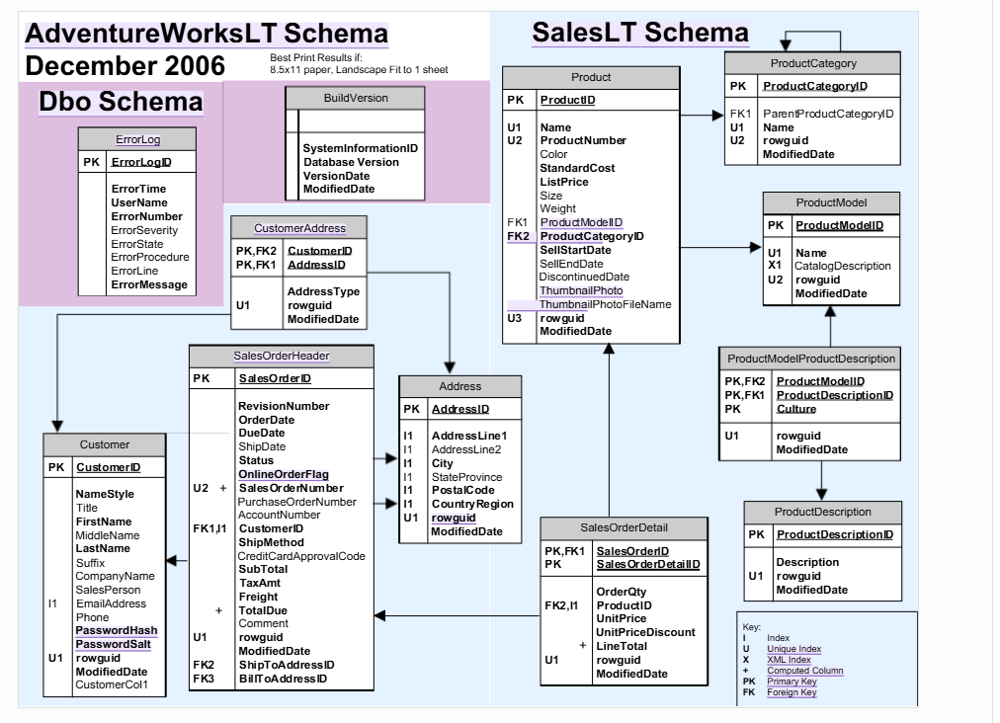

# Dataset

# AdventureWorksL Dataset

This is a database for an online store—or a company that manufactures and distributes bicycles and sporting goods—designed to handle daily sales transactions (OLTP). 

## The database consists of three main components:

### Sales and Invoice Tables (Fact Tables):

*1- SalesOrderHeader* : Records invoice headers (order date, customer, address, and totals for amounts, taxes, and shipping). 

*2- SalesOrderDetail*: Records item details within each invoice (product, quantity, unit price, and discount). 

---

### Customer and Address Tables (Customer & Address Dimensions):

 *Customer*: Customer data (name, company, email, phone). 

*Address & CustomerAddress* : Addresses, cities, and the linkage between the customer and their specific shipping and billing addresses. 

---

### Catalog and Product Tables (Product Dimensions):

*1-Product*: A list of products including their prices, colors, and sizes. 

*2-ProductCategory, 3- ProductModel, & 4-ProductDescription*: Categorization of products into groups, types, and models, along with text descriptions for each product.

# **AdventureWorksLT Schema**

---

---

# 1- SalesOrderHeader Table

| Column Name | Description |
| --- | --- |
| SalesOrderID | **Primary Key** — Unique identification number for each sales order. |
| RevisionNumber | Incremental number showing how many times the order was updated or revised. |
| OrderDate | The date the order was created and placed by the customer. |
| DueDate | Expected date by which the order should be fulfilled/received by the customer. |
| ShipDate | Date on which the order was shipped to the customer. |
| Status | Order status code (e.g., 1 = In process, 2 = Approved, 5 = Shipped). |
| OnlineOrderFlag | Boolean flag indicating order source (1 = Placed online, 0 = Placed via salesperson). |
| SalesOrderNumber | Unique reference/tracking number generated for the invoice (e.g., SO71774). |
| PurchaseOrderNumber | Customer's internal purchase order tracking number. |
| AccountNumber | Unique financial account number assigned to the customer. |
| CustomerID | **Foreign Key** — Links to `SalesLT.Customer` identifying who bought the order. |
| ShipToAddressID | **Foreign Key** — Links to `SalesLT.Address` for the delivery destination. |
| BillToAddressID | **Foreign Key** — Links to `SalesLT.Address` for the billing address. |
| ShipMethod | Name of the shipping vendor/carrier used (e.g., Cargo Transport). |
| CreditCardApprovalCode | Approval authorization code for credit card transactions. |
| SubTotal | Order cost amount before tax and shipping fees are added. |
| TaxAmt | Tax amount calculated on the order. |
| Freight | Shipping and delivery cost charges. |
| TotalDue | **Calculated Column** — Total invoice sum (`SubTotal + TaxAmt + Freight`). |
| Comment | Free-text field for administrative notes or customer instructions. |
| rowguid | System GUID used for database replication. |
| ModifiedDate | **Audit Column** — Date and time the order row was last modified (used for Incremental Extraction / Watermarking). |